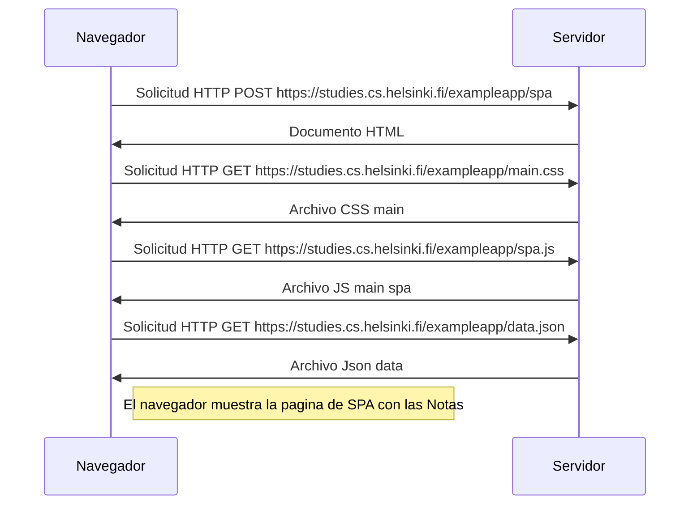

# Diagrama de secuencia que describa la interacción con el usuario al acceder a la versión de "aplicación de una sola página"
https://studies.cs.helsinki.fi/exampleapp/spa

```mermaid
sequenceDiagram

participant N as Navegador
participant S as Servidor

N ->> S: Solicitud HTTP POST https://studies.cs.helsinki.fi/exampleapp/spa
S ->> N: Documento HTML

N ->> S: Solicitud HTTP GET https://studies.cs.helsinki.fi/exampleapp/main.css
S ->> N: Archivo CSS main

N ->> S: Solicitud HTTP GET https://studies.cs.helsinki.fi/exampleapp/spa.js
S ->> N: Archivo JS main spa

N ->> S: Solicitud HTTP GET https://studies.cs.helsinki.fi/exampleapp/data.json
S ->> N: Archivo Json data

Note right of N: El navegador muestra la pagina de SPA con las Notas
```