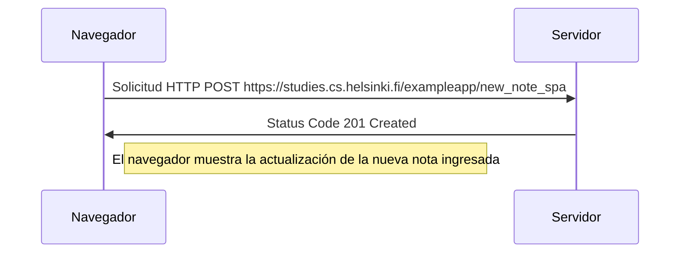

# Diagrama de secuencia que describe la interacción con el usuario al crear una nueva nota en la aplicación de una sola página
https://studies.cs.helsinki.fi/exampleapp/spa

```mermaid
sequenceDiagram

participant N as Navegador
participant S as Servidor

N ->> S: Solicitud HTTP POST https://studies.cs.helsinki.fi/exampleapp/new_note_spa
S ->> N: Status Code 201 Created

Note right of N: El navegador muestra la actualización de la nueva nota ingresada
```